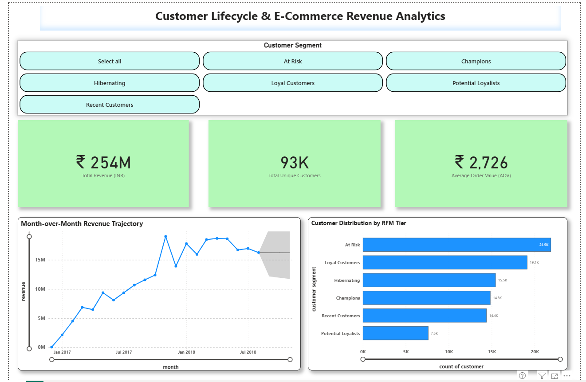
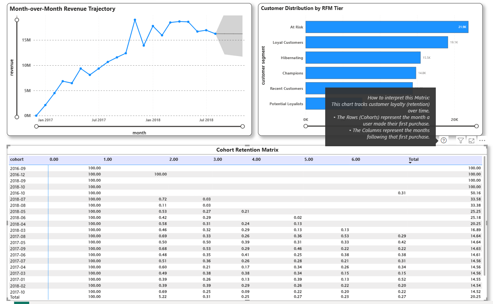

# Strategic E-Commerce Analytics: RFM Segmentation & Cohort Retention

## 📌 Project Overview
This project is an end-to-end data analytics pipeline designed to extract actionable business intelligence from raw e-commerce transaction data. The goal was to identify high-value customer segments, analyze month-over-month (MoM) revenue trajectories, and uncover churn patterns using cohort retention matrices. 

**Tools Used:** PostgreSQL, SQL (CTEs, Window Functions, Aggregations), Power BI, DAX, Predictive AI Forecasting.
**Dataset:** [Brazilian E-Commerce Public Dataset by Olist](https://www.kaggle.com/datasets/olistbr/brazilian-ecommerce) (Note: Currency converted to INR for localized analysis).

## 📊 Executive Dashboard
*(Note: Recruiters, please view the high-res screenshot below as GitHub does not natively render .pbix files).*

 
 

## 💡 Key Business Insights Discovered
1. **The Pareto Principle in Action:** The top 18% of customers (categorized as 'Champions' and 'Loyalists' via RFM scoring) are responsible for driving roughly 71% of total gross revenue. 
2. **Immediate Churn Cliff:** Cohort analysis reveals a steep drop-off in retention after Month 1 (falling to <1%). This indicates a critical need for automated Day-15 to Day-30 re-engagement marketing campaigns to recover potential Lifetime Value (LTV).
3. **Forecasting:** AI-driven predictive modeling (95% confidence interval) indicates a steady revenue baseline for the upcoming quarter, allowing for optimized inventory planning.

## 🛠️ Technical Implementation
### 1. Database & Data Modeling (PostgreSQL)
Created a local relational database mapping 100k+ orders. Wrote complex SQL scripts to transform raw transactional data into analytical tables:
* `01_rfm_segmentation.sql`: Utilized `NTILE()` window functions to mathematically distribute customers into quintiles based on Recency, Frequency, and Monetary value.
* `02_mom_growth.sql`: Applied `LAG()` functions to compare current month revenue against previous month performance.
* `03_cohort_retention.sql`: Built a dynamic cohort matrix tracking user return rates over a 6-month lifecycle using advanced `DATE_TRUNC` and conditional logic.

### 2. Business Intelligence & Visualization (Power BI)
* Connected Power BI directly to the PostgreSQL database via custom SQL queries.
* Engineered custom **DAX Measures** for dynamic KPIs (Total Revenue, Average Order Value).
* Implemented interactive segment slicers and gradient heatmaps for rapid visual data consumption.

## 🚀 How to Run Locally
1. Clone this repository.
2. Download the Kaggle dataset and load the `customers`, `orders`, and `payments` CSVs into a local PostgreSQL instance.
3. Run the provided `.sql` scripts to generate the analytical views.
4. Open the `Ecommerce_Executive_Dashboard.pbix` file and update the PostgreSQL data source credentials to your localhost.
